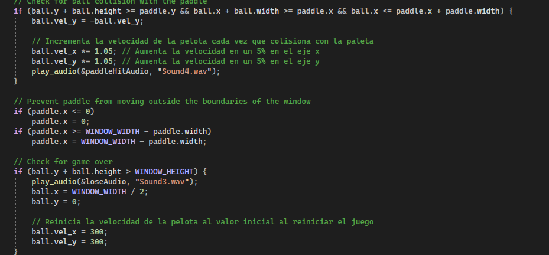
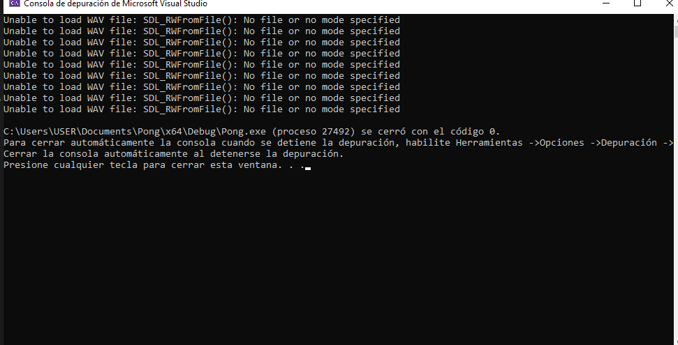
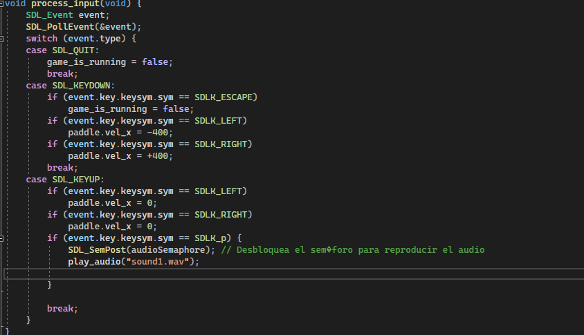
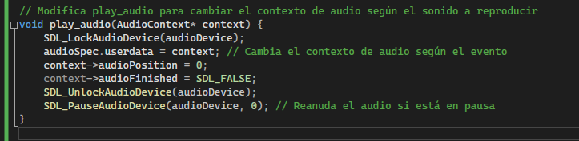

# Documentacion Final 


lo primero fue tomar un juego en SDL2 estable que se pudiese usar para implementar los elementos de esta unidad, se tuvo en cuenta que se debian insertar 5 sonidos y un power up, este primero fue hacer que la bola se acelerara al tocar la paleta, y se reiniciara al cumplirse las condiciones del game over:



luego de implementar esto se comenzo con la implementacion del audio, se cargarom y pusieron a sonar por separado cada audio para verificar que si los leyera todos, lo que afortunadamente pasó, luego se comenzaron a implementar, como se ve en el codigo anterior que ya estan siendo llamados, se modifico la funcion play audio y load audio para que los cargara todos al tiempo y se creo un hilo con un semaforo que los va dejando en cola para que los valla reproduciendo, pero esto origino un proble y es que al ejecutar el codigo sale un error que dice que no es posible cargar lo audios. 



como la imagen muestra aparece este mensaje de error el cual no se porque esta sucediendo, me estoy ayudando con ChatGPT a ver si soy capaz de identificar el porque pasa esto, se propuso la siguiente solucion: 



la cual "funciono" porque ahora si se esta reproduciendo el audio, pero se reproduce el mismo para todos los casos y sigue saliendo el mensaje de error, esto me hace sospechar que el error puede estar en como se llama los sonidos, esto se esta haciendo a travez de una variable llamada file que almacena el nombre del audio y se escribe en cada caso, pero creo que no va a funcionar por lo que parece que voy a tener que crear una funcion para cada audio.

se hizo un cambio en el codigo para que los sonido se inicialicen primero antes de depronto intentar cargar uno por uno cuando se van a reproducir, el problema es que ahora solo se esta reproduciendo el de la condicion de chocar con las paredes por lo que parece que si se va a necesitar el cambio. 



con este cambio en la funcion play audio se logra hacer que los otros audios se reproduzcan almenos una vez inicial pero no se repiten, el unico que lo hace es el de las paredes, ese si se reproduce todas las veces que pase y esta vez no se que es lo que puede estar causando eso, sigo creyendo que es la forma en que se llaman pero no estoy seguro.

ajuste los audios para que fuesen mas cortos y mejoro la forma en que sonaban y sospechaba que era que como no terminaba un audio no comenzaba el otro pero no es eso, por lo que no se que hacer, porque no hay diferencia en como se llaman los audios y las soluciones que le pido a ChatGPT no hacen nada o incluso dañan el codigo 


## Transformacion de pong a breakout

Pasos:
1. Definir la estructura del ladrillo.
2. Crear una lista de ladrillos.
3. Dibujar los ladrillos en la pantalla.
4. Detectar colisiones entre la pelota y los ladrillos.
5. Destruir los ladrillos cuando se colisiona con ellos.
6. Reiniciar los ladrillos cuando el jugador pierda.


1. Estructura de los ladrillos
Definimos una nueva estructura para los ladrillos:

```c
typedef struct {
    float x;
    float y;
    float width;
    float height;
    bool destroyed; // Si el ladrillo está destruido o no
} Brick;
```

2. Crear una lista de ladrillos
Usamos un array para representar todos los ladrillos. Los colocamos en la parte superior de la pantalla, en filas y columnas.

```c
#define NUM_ROWS 5
#define NUM_COLS 10
#define BRICK_WIDTH (WINDOW_WIDTH / NUM_COLS)
#define BRICK_HEIGHT 30

Brick bricks[NUM_ROWS][NUM_COLS]; //esto va en el archivo de constantes

```

3. Inicializar los ladrillos
En la función setup(), inicializamos los ladrillos:

```c
void setup(void) {
    // Inicialización de valores de la pelota
    ball.width = 15;
    ball.height = 15;
    ball.x = 20;
    ball.y = 20;
    ball.vel_x = 300;
    ball.vel_y = 300;

    // Inicialización de valores de la paleta
    paddle.width = 100;
    paddle.height = 20;
    paddle.x = (WINDOW_WIDTH / 2) - (paddle.width / 2);
    paddle.y = WINDOW_HEIGHT - 40;
    paddle.vel_x = 0;
    paddle.vel_y = 0;

    // Inicializar los ladrillos
    for (int row = 0; row < NUM_ROWS; row++) {
        for (int col = 0; col < NUM_COLS; col++) {
            bricks[row][col].x = col * BRICK_WIDTH;
            bricks[row][col].y = row * BRICK_HEIGHT;
            bricks[row][col].width = BRICK_WIDTH;
            bricks[row][col].height = BRICK_HEIGHT;
            bricks[row][col].destroyed = false;
        }
    }
}
```

4. Dibujar los ladrillos
En la función render(), agregamos el código para dibujar los ladrillos. Solo se dibujarán aquellos que no estén destruidos.

```c
    void render(void) {
    SDL_SetRenderDrawColor(renderer, 0, 0, 0, 255);
    SDL_RenderClear(renderer);

    // Dibujar un rectángulo para el objeto pelota
    SDL_Rect ball_rect = {
        (int)ball.x,
        (int)ball.y,
        (int)ball.width,
        (int)ball.height
    };
    SDL_SetRenderDrawColor(renderer, 255, 255, 255, 255);
    SDL_RenderFillRect(renderer, &ball_rect);

    // Dibujar un rectángulo para el objeto paleta
    SDL_Rect paddle_rect = {
        (int)paddle.x,
        (int)paddle.y,
        (int)paddle.width,
        (int)paddle.height
    };
    SDL_SetRenderDrawColor(renderer, 255, 255, 255, 255);
    SDL_RenderFillRect(renderer, &paddle_rect);

    // Dibujar los ladrillos
    for (int row = 0; row < NUM_ROWS; row++) {
        for (int col = 0; col < NUM_COLS; col++) {
            if (!bricks[row][col].destroyed) {
                SDL_Rect brick_rect = {
                    (int)bricks[row][col].x,
                    (int)bricks[row][col].y,
                    (int)bricks[row][col].width,
                    (int)bricks[row][col].height
                };
                SDL_SetRenderDrawColor(renderer, 255, 0, 0, 255); // Rojo para los ladrillos
                SDL_RenderFillRect(renderer, &brick_rect);
            }
        }
    }

    SDL_RenderPresent(renderer);
    }
```

5. Detectar colisiones entre la pelota y los ladrillos
En la función update(), verificamos si la pelota ha colisionado con alguno de los ladrillos. Si hay colisión, destruimos el ladrillo (lo marcamos como destruido) y cambiamos la dirección de la pelota:

```c
void update(void) {
    int time_to_wait = FRAME_TARGET_TIME - (SDL_GetTicks() - last_frame_time);

    if (time_to_wait > 0 && time_to_wait <= FRAME_TARGET_TIME)
        SDL_Delay(time_to_wait);

    float delta_time = (SDL_GetTicks() - last_frame_time) / 1000.0;
    last_frame_time = SDL_GetTicks();

    ball.x += ball.vel_x * delta_time;
    ball.y += ball.vel_y * delta_time;
    paddle.x += paddle.vel_x * delta_time;

    if (ball.x <= 0 || ball.x + ball.width >= WINDOW_WIDTH) {
        ball.vel_x = -ball.vel_x;
        play_audio(&wallHitAudio);
    }
    if (ball.y < 0) {
        ball.vel_y = -ball.vel_y;
        play_audio(&wallHitAudio);
    }

    // Colisión con la paleta
    if (ball.y + ball.height >= paddle.y && ball.x + ball.width >= paddle.x && ball.x <= paddle.x + paddle.width) {
        ball.vel_y = -ball.vel_y;
        ball.vel_x *= 1.05;
        ball.vel_y *= 1.05;
        play_audio(&paddleHitAudio);
    }

    // Colisiones con los ladrillos
    for (int row = 0; row < NUM_ROWS; row++) {
        for (int col = 0; col < NUM_COLS; col++) {
            if (!bricks[row][col].destroyed) {
                if (ball.x + ball.width > bricks[row][col].x &&
                    ball.x < bricks[row][col].x + bricks[row][col].width &&
                    ball.y + ball.height > bricks[row][col].y &&
                    ball.y < bricks[row][col].y + bricks[row][col].height) {

                    // Marcar el ladrillo como destruido
                    bricks[row][col].destroyed = true;

                    // Rebotar la pelota
                    ball.vel_y = -ball.vel_y;
                    play_audio(&wallHitAudio); // Sonido de colisión con ladrillo
                }
            }
        }
    }

    // Si la pelota cae fuera de la pantalla
    if (ball.y + ball.height > WINDOW_HEIGHT) {
        play_audio(&loseAudio);
        ball.x = WINDOW_WIDTH / 2;
        ball.y = 0;
        ball.vel_x = 300;
        ball.vel_y = 300;

        // Reiniciar los ladrillos
        for (int row = 0; row < NUM_ROWS; row++) {
            for (int col = 0; col < NUM_COLS; col++) {
                bricks[row][col].destroyed = false;
            }
        }
    }
}
```

6. Reiniciar los ladrillos cuando el jugador pierda
Cuando la pelota caiga fuera de la pantalla (y el jugador pierda), volvemos a colocar los ladrillos en su posición original.

